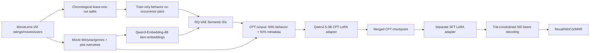
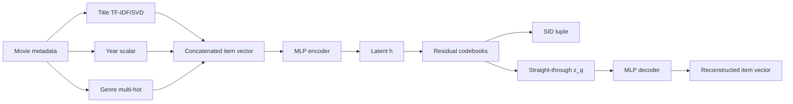
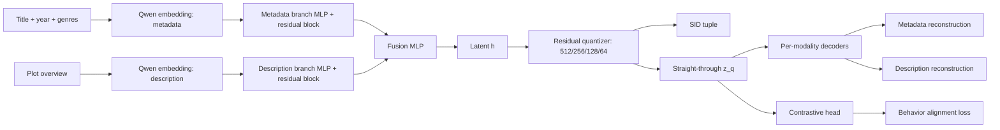

# PLUM-style Generative Recommendation on MovieLens-1M

Repository for a MovieLens-1M reproduction of a PLUM-like generative recommendation pipeline:

1. enrich items with movie metadata and short plot descriptions;
2. build content-aware item embeddings;
3. train RQ-VAE Semantic IDs;
4. run LoRA continued pre-training (CPT) on SID-aware behavior and metadata text;
5. run a separate LoRA supervised fine-tuning (SFT) stage for next-item generative retrieval;
6. evaluate with constrained SID decoding and Recall/NDCG/MRR.

The repository keeps notebooks, reusable helpers, reports, and local artifacts separated so the current state is easy to inspect and present.

## Current Snapshot

The first SID series performed poorly on retrieval (`Recall@10 = 0.0253` on full validation). The current active series is **SID-v2**:

- item descriptions were added for MovieLens-1M films;
- item embeddings were rebuilt with `Qwen/Qwen3-Embedding-4B` embeddings (`2560d`);
- RQ-VAE was upgraded from a small prototype to an approximately `7.3M` parameter model;
- `Qwen/Qwen2.5-3B` was continued-pretrained with LoRA on SID metadata and train-only behavior, then saved as a merged CPT checkpoint;
- a separate Qwen2.5-3B SFT-LoRA adapter was trained on top of the merged CPT checkpoint and evaluated on the full validation split.

Validation trajectory:

| Series | SID source | Model / setup | Validation scope | Recall@10 | Status |
|---|---|---|---:|---:|---|
| SID-v1 first retrieval attempt | engineered title/year/genre features, no descriptions | GPT-2 S weak-CPT SFT | 6040 users | 0.0253 | failed retrieval series |
| SID-v2 baseline | `Qwen/Qwen3-Embedding-4B` item embeddings + descriptions | GPT2-S SFT | 6040 users | 0.1462 | working baseline |
| SID-v2 current best | `Qwen/Qwen3-Embedding-4B` item embeddings + descriptions | Qwen2.5-3B CPT-LoRA merged checkpoint + SFT-LoRA | 6040 users | 0.2318 | current best validation run |

Detailed current validation result:

| Model / setup | Validation users | Recall@1 | Recall@5 | Recall@10 | NDCG@10 | MRR@10 | Coverage@10 |
|---|---:|---:|---:|---:|---:|---:|---:|
| GPT2-S + SID-v2 SFT | 6040 | 0.0336 | 0.1075 | 0.1462 | 0.0836 | 0.0643 | 1185 |
| Qwen2.5-3B CPT-LoRA + SFT-LoRA + SID-v2 | 6040 | 0.0598 | 0.1657 | 0.2318 | 0.1348 | 0.1051 | 1924 |

The Qwen2.5-3B CPT-LoRA plus SFT-LoRA run improves full-validation `Recall@10` by roughly `+0.086` absolute and about `+58%` relative over the GPT2-S SID-v2 run.

`Invalid SID rate` is omitted from the comparison table because all compared runs use trie-constrained decoding over valid item SID sequences, so invalid generations are ruled out by construction.

Important interpretation note: the current result is on the **validation split**, not the final test split. The test split should be used only once after the protocol and hyperparameters are frozen.

The SID-v1 value comes from the archived full-validation GPT-2 S weak-CPT run and is included only to document why the first SID series was abandoned.

## Pipeline



## RQ-VAE Architecture Evolution

The project has two relevant RQ-VAE generations. The first one was useful for building the pipeline but failed as a retrieval representation. The second one is the active SID-v2 tokenizer.

### SID-v1 RQ-VAE



Main properties:

| Component | SID-v1 design |
|---|---|
| Item signal | title/year/genres only |
| Input form | single concatenated feature vector |
| Encoder/decoder | compact MLP |
| Quantization | residual codebooks over one latent vector |
| Training signal | reconstruction + RQ codebook/commitment losses, later behavior contrastive variants |
| Retrieval result | `Recall@10 = 0.0253` in the first full-validation SFT run, so the series was discarded |

### SID-v2 RQ-VAE



Main properties:

| Component | SID-v2 design |
|---|---|
| Item signal | separate metadata and description embeddings |
| Input form | two modality branches |
| Encoder/fusion | branch MLPs with residual blocks, then fusion MLP |
| Quantization | residual codebooks `512 / 256 / 128 / 64` |
| Decoders | separate reconstruction heads for metadata and description |
| Behavior signal | train-only weighted co-occurrence contrastive loss |
| Best SID uniqueness | `3695 / 3706 = 0.9970` |
| Best downstream validation | `Recall@10 = 0.2318` with Qwen2.5-3B CPT-LoRA plus separate SFT-LoRA |

## Project Structure

```text
.
|-- README.md
|-- requirements.txt
|-- requirements-lock.txt
|-- src/
|   |-- sid/        # Qwen3 embeddings, RQ-VAE, behavior pairs, training loop
|   |-- cpt/        # CPT schema, corpus building, tokenizer helpers, training helpers
|   |-- sft/        # SFT examples, SID mapping, decoding, metrics
|   `-- rqvae.py    # legacy reusable RQ-VAE module kept for old notebooks
|-- scripts/
|   |-- run_qwen4b_rqvae_sid_v2.py
|   |-- run_advanced_rqvae_sid_v2.py
|   `-- reporting/
|-- notebooks/
|   |-- data_prep/       # raw MovieLens checks, reindexing, splits, old item features
|   |-- sid_v1_legacy/   # first SID/RQ-VAE notebooks and diagnostics
|   |-- sid_v2/          # current Qwen3 embeddings, RQ-VAE SID-v2, SID heuristics
|   |-- cpt/             # CPT notebooks, including Qwen2.5-3B LoRA CPT
|   |-- sft/             # SFT notebooks, including Qwen2.5-3B SFT-LoRA
|   `-- reporting/       # executed experiment-report notebooks
|-- research/
|   `-- movie_overviews/ # separate movie-description enrichment branch
|-- reports/
|   |-- status/
|   |-- methodology/
|   |-- sid/
|   |-- cpt/
|   `-- sft/
|-- data/                # ignored: raw data, processed data, model artifacts
`-- runs/                # ignored: RQ-VAE checkpoints and experiment outputs
```

Report markdown files under `reports/` are treated as local project notes and are ignored by git. `README.md` files remain trackable.

## Data

MovieLens-1M must be placed locally under:

```text
data/raw/ml-1m/ratings.dat
data/raw/ml-1m/movies.dat
data/raw/ml-1m/users.dat
```

Generated data and model artifacts are intentionally not tracked:

```text
data/processed/
runs/
```

Current local split summary:

| Split | Rows | Users |
|---|---:|---:|
| train | 988129 | 6040 |
| val | 6040 | 6040 |
| test | 6040 | 6040 |

The split is chronological leave-one-out:

- train contains all but the last two events for each user;
- validation contains the penultimate event;
- test contains the final event.

Sanity checks performed on the current split:

- `train` and `val` intersection by `(user_id, item_idx)`: `0`;
- `train` and `test` intersection by `(user_id, item_idx)`: `0`;
- `val` and `test` intersection by `(user_id, item_idx)`: `0`;
- validation target inside the last-12 train prompt: `0`;

## Main Notebooks

### Data and Movie Descriptions

- `notebooks/data_prep/00_sanity.ipynb`
  Loads MovieLens-1M, validates the raw files, builds chronological splits.

- `research/movie_overviews/notebooks/00_build_movie_overviews.ipynb`
  Builds the movie overview dataset. Missing descriptions are preserved as empty rows instead of dropping movies.

### SID-v2

- `notebooks/sid_v2/00_qwen4b_embedding_stage.ipynb`
  Builds `Qwen/Qwen3-Embedding-4B` embeddings for:
  - `meta_text = title + year + genres`;
  - `description_text = plot overview`.

- `notebooks/sid_v2/02_qwen4b_rqvae_sid_v2.ipynb`
  Trains the active RQ-VAE SID-v2 model.

- `notebooks/sid_v2/03_sid_quality_heuristics.ipynb`
  Produces heuristic SID quality plots: uniqueness by depth, genre profiles, prefix interpretability.

### CPT

- `notebooks/cpt/03_cpt_qwen2_5_3b_base_sid_v2.ipynb`
  Continued-pretrains `Qwen/Qwen2.5-3B` with LoRA on a PLUM-like mixture of behavior and metadata examples, then writes both the CPT adapter and the merged CPT checkpoint.

- `notebooks/cpt/04_cpt_qwen2_5_3b_grounding_eval.ipynb`
  Evaluates whether CPT grounded SIDs into titles, years, genres, and short descriptions.

### SFT

- `notebooks/sft/03_sft_gpt2_small_sid_v2_next_watch_plum.ipynb`
  GPT2-S SFT baseline on SID-v2.

- `notebooks/sft/04_sft_qwen2_5_3b_sid_v2_next_watch_w12.ipynb`
  Current Qwen2.5-3B SFT-LoRA run on top of the merged CPT checkpoint, with history window `12` and trie-constrained SID decoding.

## Current Artifacts

These paths are local and ignored by git:

| Stage | Artifact |
|---|---|
| Qwen3 embeddings | `data/processed/item_features/qwen4b_audited_v1_meta_desc_embeddings.npz` |
| Item profiles | `data/processed/item_features/qwen4b_audited_v1_item_profiles.parquet` |
| RQ-VAE SID-v2 | `runs/qwen4b_rqvae_sid_v2_plum/SIDs_best.npy` |
| Qwen CPT LoRA adapter | `data/processed/artifacts/cpt_qwen2_5_3b_base_sid_v2_plum_curriculum_v1/adapter` |
| Qwen CPT merged checkpoint | `data/processed/artifacts/cpt_qwen2_5_3b_base_sid_v2_plum_curriculum_v1/final_merged` |
| Qwen SFT best adapter | `data/processed/artifacts/sft_qwen2_5_3b_sid_v2_next_watch_w12_v1/best_adapter` |
| Qwen SFT full-val metrics | `data/processed/artifacts/sft_qwen2_5_3b_sid_v2_next_watch_w12_v1/full_val_metrics.json` |

## SID-v2 Summary

Active SID artifact:

```text
runs/qwen4b_rqvae_sid_v2_plum/SIDs_best.npy
```

Current SID statistics:

| Metric | Value |
|---|---:|
| Items | 3706 |
| SID levels | 4 |
| Codebook sizes | 512 / 256 / 128 / 64 |
| Unique full SIDs | 3695 |
| Collisions | 11 |
| SID uniqueness | 0.9970 |
| RQ-VAE parameters | 7324480 |

The RQ-VAE uses two Qwen-embedding modalities:

- metadata branch: title/year/genres;
- description branch: plot overview.

The behavior contrastive signal is built only from `train.parquet` using weighted local co-occurrence pairs.

## CPT Summary

The active Qwen CPT run uses PEFT/LoRA, not full fine-tuning:

- base model: `Qwen/Qwen2.5-3B`;
- adaptation: LoRA/PEFT;
- LoRA rank: `16`;
- LoRA alpha/dropout: `32` / `0.05`;
- LoRA target modules: `q_proj`, `k_proj`, `v_proj`, `o_proj`, `gate_proj`, `up_proj`, `down_proj`;
- precision: `bf16`;
- behavior source: train split only;
- metadata source: all item metadata each synthetic epoch plus short description shards;
- synthetic epochs: `15`;
- total CPT examples: `233482`;
- behavior examples: `116741`;
- metadata core examples: `55590`;
- metadata reverse/field examples: `55590`;
- metadata description examples: `5561`.

CPT is used to teach the language model SID syntax and SID-to-metadata grounding before next-item SFT. The saved `final_merged` checkpoint is the base model plus the CPT LoRA adapter merged into the model weights.

## SFT Summary

Active Qwen SFT setup:

- task: next watched movie;
- base checkpoint: Qwen2.5-3B after SID-v2 LoRA CPT, loaded from `final_merged`;
- adaptation: separate SFT LoRA adapter;
- LoRA rank: `16`;
- LoRA alpha/dropout: `32` / `0.05`;
- history window: `12`;
- target: next item SID only;
- decoding: trie-constrained beam search over valid item SIDs;
- filtering: already-seen items are filtered from candidates;
- validation: full `6040` validation users.

Best observed full-validation result:

```json
{
  "recall@1": 0.0597682119205298,
  "recall@5": 0.16572847682119204,
  "recall@10": 0.23178807947019867,
  "ndcg@10": 0.13475599887125705,
  "mrr@10": 0.10509730106170502,
  "coverage@10": 1924,
  "seen_generated_rate": 0.05134933774834437
}
```

## PLUM Alignment

| PLUM component | Current implementation | Status |
|---|---|---|
| Semantic ID item tokenizer | RQ-VAE over item embeddings | Implemented |
| Multimodal/content item signal | title/year/genres + plot descriptions via `Qwen/Qwen3-Embedding-4B` embeddings | Implemented for text modalities |
| Behavior-aware SID regularization | train-only weighted co-occurrence contrastive loss | Implemented |
| Continued pre-training | behavior + metadata curriculum with SID tokens | Implemented |
| SFT for next-item generation | target-only next SID prediction | Implemented |
| Constrained SID decoding | trie-constrained beam search over valid item SIDs | Implemented |
| Final test evaluation | held back until protocol freeze | Pending |
| Strong external baseline reproduction | SASRec/BERT4Rec-style baseline not yet reproduced locally | Pending |

## Repro Path

For a fresh local run:

1. Put MovieLens-1M files under `data/raw/ml-1m/`.
2. Run `notebooks/data_prep/00_sanity.ipynb`.
3. Build or update movie overviews in `research/movie_overviews/`.
4. Run `notebooks/sid_v2/00_qwen4b_embedding_stage.ipynb`.
5. Run `notebooks/sid_v2/02_qwen4b_rqvae_sid_v2.ipynb`.
6. Run `notebooks/cpt/03_cpt_qwen2_5_3b_base_sid_v2.ipynb`.
7. Run `notebooks/sft/04_sft_qwen2_5_3b_sid_v2_next_watch_w12.ipynb`.
8. Evaluate full validation from `best_adapter`.
9. Run test only after the protocol is frozen.

## Environment

Install the main stack:

```powershell
python -m pip install -r requirements.txt
```

For a closer snapshot of the local environment:

```powershell
python -m pip install -r requirements-lock.txt
```

Use the same Python environment for terminal commands and the Jupyter kernel. `requirements-lock.txt` is the current local dependency snapshot.

## Known Limitations

- The best Qwen result is validation-only. The test split is intentionally not used yet.
- Current SFT uses a single history window (`12`). Longer windows (`16`, `24`, or mixed windows) are a natural next experiment.
- Full validation with beam search is slow because it performs autoregressive generation over thousands of users.
- The current comparison to public sequential recommendation baselines is approximate until local baselines are reproduced under the same split and full-catalog evaluation protocol.
- Markdown reports in `reports/` are local project notes and are ignored by git, except `README.md`.
