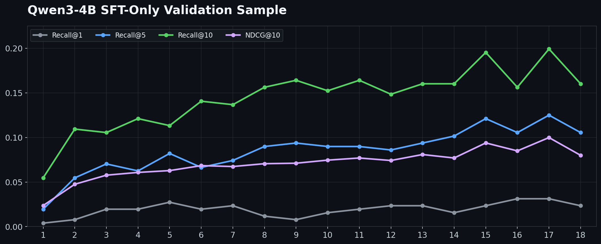
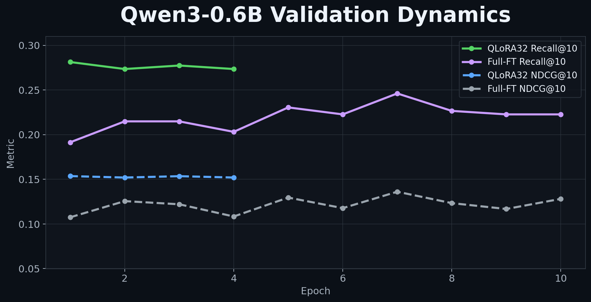
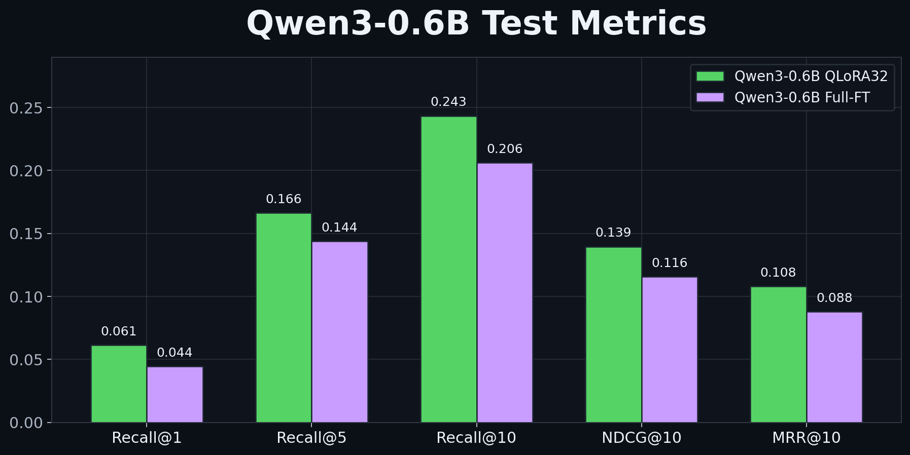
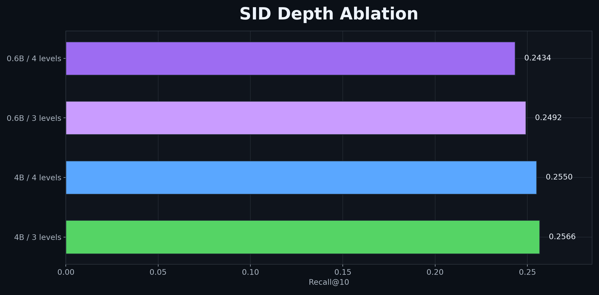
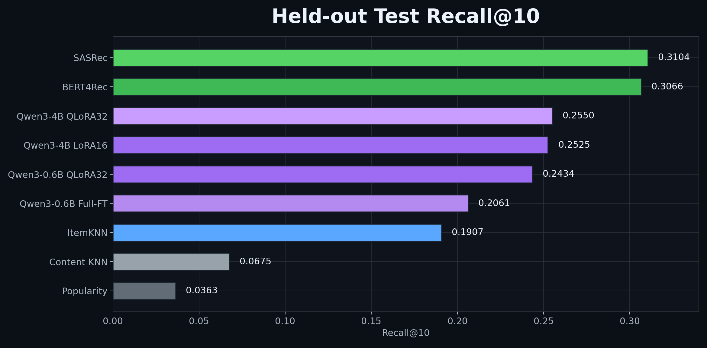

# PLUM-style Generative Recommendation on MovieLens-1M

This project is a PLUM-style adaptation for MovieLens-1M. It studies how Semantic IDs, continued pre-training, supervised fine-tuning, and constrained decoding can be used for next-item recommendation.

This is **not** a SOTA claim. The main goal is to keep the pipeline clear, reproducible, and easy to review. A few simple and neural baselines are included only to compare results under the same split and evaluation protocol.

## What Is Implemented

- Chronological MovieLens-1M preprocessing and leave-one-out splits.
- Movie metadata with title, year, genres, and audited plot overviews.
- Content embeddings, RQ-VAE Semantic IDs, and SID-v2 assignment tables.
- Qwen3 CPT/SFT experiments with LoRA and QLoRA adapters.
- Trie-constrained SID decoding with SID-to-item mapping, collision handling, and seen-item filtering.
- Recall, NDCG, MRR, and Coverage evaluation.
- Popularity, content KNN, ItemKNN, BERT4Rec, and SASRec comparison runs under the same protocol.
- Configs, tests, CLI commands, Makefile targets, docs, and CI checks.

## Active Protocol

The active protocol is SID-v2.

| Component | Value |
|---|---|
| Dataset | MovieLens-1M |
| Split | chronological leave-one-out |
| Item text | title + year + genres + audited plot overview |
| Embeddings | `Qwen/Qwen3-Embedding-4B`, 2560d |
| SID model | RQ-VAE |
| SID levels | 4 |
| Codebook sizes | `[512, 256, 128, 64]` |
| Collision policy | expand SID bucket to candidate items, then filter seen/duplicates |
| CPT behavior source | train split only |
| SFT target | next watched item |
| Decoding | trie-constrained beam search |
| Metric id space | original `item_idx` after SID-to-item mapping |
| Main test seen filtering | all items watched before the target timestamp |

## Reported Metrics

The metrics below are preserved from existing experiment outputs. Popularity, content KNN, behavioral ItemKNN, BERT4Rec, SASRec, and Qwen SID rows were produced by downstream train+val -> test runs and are reported as actual held-out evaluations, not as manual edits. In the generative Qwen rows, CPT uses the active train-only corpus and train+val refers to the SFT/evaluation context. The no-CPT ablation is listed in the validation block because it was evaluated on the full validation split only and was not promoted to held-out test reporting.

Validation runs used for protocol selection:

| Series | Model / setup | SID codebooks | Scope | Recall@1 | Recall@5 | Recall@10 | NDCG@10 | MRR@10 | Coverage@10 | Status |
|---|---|---|---:|---:|---:|---:|---:|---:|---:|---|
| SID-v1 first retrieval attempt | GPT-2 S weak-CPT SFT, no descriptions | legacy SID-v1 | val 6040 | - | - | 0.0253 | - | - | - | discarded |
| SID-v2 GPT2 reference | GPT2-S CPT + SFT | `[512, 256, 128, 64]` | val 6040 | 0.0336 | 0.1075 | 0.1462 | 0.0836 | 0.0643 | 1185 | working internal reference |
| SID-v2 Qwen3 SFT-only w16 | Qwen3-4B Base + SFT-LoRA, no CPT, window 16, best epoch 17 | `[512, 256, 128, 64]` | val 6040 | 0.0366 | 0.1151 | 0.1747 | 0.0954 | 0.0713 | 1470 | no-CPT ablation |
| SID-v2 Qwen3 QLoRA32 w16 | Qwen3-4B CPT-QLoRA32 merged checkpoint + SFT-QLoRA32, window 16, best epoch 3 | `[512, 256, 128, 64]` | val 6040 | 0.0646 | 0.1876 | 0.2707 | 0.1538 | 0.1182 | 2173 | selected validation run |

Qwen3 SFT-only ablation:

Direct SFT without CPT reaches `Recall@10 = 0.1747` on the full validation split. The CPT-grounded QLoRA32 run reaches `Recall@10 = 0.2707` under the same full-validation, all-history seen-filtering protocol.



Protocol: Qwen3-4B Base, SFT-LoRA, no CPT, 256-user validation monitor, history window 16, SID-v2 targets, target-only next-SID loss, trie-constrained decoding, original item ID metrics.

Qwen3-0.6B QLoRA32 vs full fine-tuning:

Controlled comparison: Qwen3-0.6B, 4-level SID-v2, history window 16, trie-constrained decoding, and all-prior-user-history seen filtering. The curve is the 256-user validation monitor; the table reports held-out test metrics.





| Setup | Update | SID codebooks | SFT epochs | Test users | Recall@1 | Recall@5 | Recall@10 | NDCG@10 | MRR@10 | Coverage@10 |
|---|---|---|---:|---:|---:|---:|---:|---:|---:|---:|
| Qwen3-0.6B QLoRA32 | QLoRA32 | `[512, 256, 128, 64]` | 1 | 6040 | 0.0613 | 0.1662 | 0.2434 | 0.1395 | 0.1079 | 1776 |
| Qwen3-0.6B full-FT | full-FT | `[512, 256, 128, 64]` | 7 | 6040 | 0.0444 | 0.1437 | 0.2061 | 0.1156 | 0.0878 | 1364 |

SID depth ablation:

The active protocol remains 4 SID levels with codebook sizes `[512, 256, 128, 64]`. A 3-level Qwen3 QLoRA32 ablation with `[512, 256, 128]` has marginally higher Recall@10 for both 0.6B and 4B.



| Model | SID levels | SID codebooks | Test users | Recall@10 | NDCG@10 | MRR@10 | Coverage@10 |
|---|---:|---|---:|---:|---:|---:|---:|
| Qwen3-0.6B QLoRA32 | 4 | `[512, 256, 128, 64]` | 6040 | 0.2434 | 0.1395 | 0.1079 | 1776 |
| Qwen3-0.6B QLoRA32 | 3 | `[512, 256, 128]` | 6040 | 0.2492 | 0.1434 | 0.1111 | 1843 |
| Qwen3-4B QLoRA32 | 4 | `[512, 256, 128, 64]` | 6040 | 0.2550 | 0.1450 | 0.1116 | 2143 |
| Qwen3-4B QLoRA32 | 3 | `[512, 256, 128]` | 6040 | 0.2566 | 0.1459 | 0.1122 | 2073 |

Train+val to held-out test:



Protocol: MovieLens-1M chronological split, train+val context where applicable, all-prior-user-history seen filtering. Sequence models use history window 16. Content KNN ranks concatenated metadata + overview vectors. ItemKNN uses interactions only. The BERT4Rec and SASRec rows use item IDs plus projected content vectors. Qwen runs use SID-v2 trie-constrained decoding.

The PLUM-style Qwen rows are competitive in this setup, but they do not exceed the strongest SASRec and BERT4Rec rows on MovieLens-1M held-out test metrics.

| Protocol | Fit / context source | SID codebooks | Seen filtering | Test users | Recall@1 | Recall@5 | Recall@10 | NDCG@10 | MRR@10 | Coverage@10 |
|---|---|---|---|---:|---:|---:|---:|---:|---:|---:|
| Global Popularity | train + val | n/a | all prior user history | 6040 | 0.0056 | 0.0202 | 0.0363 | 0.0178 | 0.0123 | 199 |
| Content KNN | train + val context | n/a | all prior user history | 6040 | 0.0169 | 0.0414 | 0.0675 | 0.0374 | 0.0284 | 1170 |
| Behavioral ItemKNN | train + val interactions | n/a | all prior user history | 6040 | 0.0427 | 0.1268 | 0.1907 | 0.1056 | 0.0798 | 1788 |
| Qwen3-0.6B full-FT | train-only CPT, train + val SFT | `[512, 256, 128, 64]` | all prior user history | 6040 | 0.0444 | 0.1437 | 0.2061 | 0.1156 | 0.0878 | 1364 |
| Qwen3-0.6B QLoRA32 | train-only CPT, train + val SFT | `[512, 256, 128, 64]` | all prior user history | 6040 | 0.0613 | 0.1662 | 0.2434 | 0.1395 | 0.1079 | 1776 |
| Qwen3-4B LoRA16 | train-only CPT, train + val SFT | `[512, 256, 128, 64]` | all prior user history | 6040 | 0.0626 | 0.1765 | 0.2525 | 0.1451 | 0.1123 | 2108 |
| Qwen3-4B QLoRA32 | train-only CPT, train + val SFT | `[512, 256, 128, 64]` | all prior user history | 6040 | 0.0619 | 0.1755 | 0.2550 | 0.1450 | 0.1116 | 2143 |
| BERT4Rec | train + val | n/a | all prior user history | 6040 | 0.0861 | 0.2166 | 0.3066 | 0.1823 | 0.1443 | 2842 |
| SASRec | train + val | n/a | all prior user history | 6040 | 0.0844 | 0.2250 | 0.3104 | 0.1835 | 0.1446 | 2455 |

Coverage@10 is the number of unique original items recommended across users. Invalid SID rate is not listed in the comparison table because the reported runs use trie-constrained decoding over valid item SID sequences.

## Evaluation

Evaluation is item-level, not SID-level:

1. The model generates SID token sequences.
2. A trie restricts generation to valid item SID sequences.
3. Each generated SID is mapped back to one or more original `item_idx` values.
4. SID collisions are expanded.
5. Already seen items and duplicate recommendations are removed. Current main test reporting filters all items watched before the target timestamp.
6. Recall@K, NDCG@K, MRR@K, and Coverage@K are computed over original item IDs.

Formulas and tests are documented in [docs/EVALUATION.md](docs/EVALUATION.md).

## Quickstart

Install the lightweight package and dev tools:

```bash
python -m pip install -e ".[dev]"
```

Run lightweight checks:

```bash
make test
make lint
make config-check
make artifacts-check-schema
make smoke-test
```

If `make` is not available, run the same checks directly:

```bash
python -m pytest -m "not gpu and not slow"
python -m ruff check src tests scripts
python -m compileall -q src tests scripts
python -m plum_ml1m.cli validate-config --config-dir configs
python -m plum_ml1m.cli validate-artifacts --manifest configs/artifact_manifest.yaml --mode schema
python -m plum_ml1m.cli smoke-test
```

The commands above do not train models or download large checkpoints.

## CLI

The CLI provides safe entry points for the pipeline. Heavy commands validate configs and print execution plans unless `--execute` is explicitly passed.

```bash
plum-ml1m prepare-data --config configs/prepare_data.yaml
plum-ml1m build-metadata --config configs/metadata.yaml
plum-ml1m build-embeddings --config configs/embeddings.yaml
plum-ml1m train-sid --config configs/rqvae_sid.yaml
plum-ml1m train-cpt --config configs/cpt.yaml
plum-ml1m train-sft --config configs/sft.yaml
plum-ml1m evaluate --config configs/evaluation_val.yaml
plum-ml1m evaluate --config configs/evaluation_test.yaml
plum-ml1m smoke-test
```

## Repository Structure

```text
configs/                 YAML configs and artifact manifest
docs/                    public documentation
notebooks/               experiment notebooks and archived runs
scripts/                 notebook runner and legacy/experimental launchers
src/plum_ml1m/           reusable public package surface
src/plum_ml1m/legacy/    historical CPT/SID/SFT helpers used by older notebooks
tests/                   lightweight tests for protocol and evaluation logic
```

Large generated artifacts are intentionally not tracked. See [docs/ARTIFACTS.md](docs/ARTIFACTS.md).

Notebook and experiment-script navigation:

- [notebooks/README.md](notebooks/README.md)
- [scripts/experiments/README.md](scripts/experiments/README.md)

## Documentation

- [Quickstart](docs/QUICKSTART.md)
- [Reproduction](docs/REPRODUCTION.md)
- [Pipeline](docs/PIPELINE.md)
- [Results snapshot](docs/RESULTS.md)
- [Evaluation](docs/EVALUATION.md)
- [Artifacts](docs/ARTIFACTS.md)
- [Environment](docs/ENVIRONMENT.md)
- [Legacy code](docs/LEGACY_CODE.md)
- [Troubleshooting](docs/TROUBLESHOOTING.md)
- [Known limitations](docs/KNOWN_LIMITATIONS.md)

## CI

GitHub Actions runs only lightweight checks:

- install lightweight package;
- compile/lint checks;
- unit tests;
- config validation;
- artifact manifest validation;
- smoke test.

CI does not run heavy training and does not download large models.

## License

MIT License. See [LICENSE](LICENSE).
