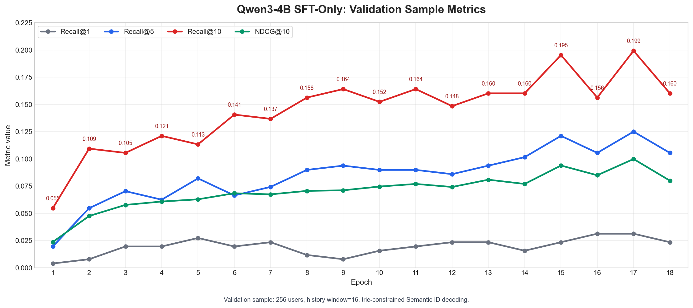

# PLUM-style Generative Recommendation on MovieLens-1M

This repository contains a PLUM-style reproduction/adaptation for MovieLens-1M. The goal is to study a generative recommendation pipeline based on Semantic IDs, continued pre-training, supervised fine-tuning, and constrained decoding.

This is **not** a SOTA claim. The current focus is reproducibility, inspectability, and a clean engineering surface for review. A simple global Popularity sanity baseline is included only to anchor the reported generative results; this repository is not a broad recommender benchmark suite.

## What Is Implemented

1. MovieLens-1M chronological leave-one-out split handling.
2. Movie metadata enrichment with title, year, genres, and plot overviews.
3. Content embeddings for item metadata and descriptions.
4. RQ-VAE Semantic ID training for the active SID-v2 protocol.
5. LoRA CPT on SID metadata and train-only behavior.
6. LoRA SFT for next watched item generation.
7. Trie-constrained SID decoding.
8. SID-to-original-item mapping with collision expansion and seen-item filtering.
9. Recall/NDCG/MRR/Coverage evaluation.
10. Lightweight global Popularity sanity baseline.
11. Qwen3 no-CPT direct SFT ablation for measuring the value of CPT grounding.
12. Lightweight configs, tests, CLI, Makefile, docs, and CI.

## Active Protocol

The active protocol is SID-v2.

| Component | Value |
|---|---|
| Dataset | MovieLens-1M |
| Split | chronological leave-one-out |
| Item text | title + year + genres + audited plot overview |
| Embeddings | `Qwen/Qwen3-Embedding-4B`, 2560d |
| SID model | RQ-VAE |
| SID levels | 4 |
| Codebook sizes | `[1024, 512, 256, 128]` |
| Collision policy | expand SID bucket to candidate items, then filter seen/duplicates |
| CPT behavior source | train split only |
| SFT target | next watched item |
| Decoding | trie-constrained beam search |
| Metric id space | original `item_idx` after SID-to-item mapping |
| Main test seen filtering | all items watched before the target timestamp |

## Reported Metrics

The metrics below are preserved from existing experiment outputs. The Qwen3 test rows and Popularity sanity baseline were produced by current train+val -> test runs and are reported as actual held-out evaluations, not as manual edits. The no-CPT ablation is intentionally listed separately because it was measured on a 256-user validation sample, not on the full validation or test split.

Validation runs used for protocol selection:

| Series | Model / setup | Scope | Recall@1 | Recall@5 | Recall@10 | NDCG@10 | MRR@10 | Coverage@10 | Status |
|---|---|---:|---:|---:|---:|---:|---:|---:|---|
| SID-v1 first retrieval attempt | GPT-2 S weak-CPT SFT, no descriptions | val 6040 | - | - | 0.0253 | - | - | - | discarded |
| SID-v2 GPT2 reference | GPT2-S CPT + SFT | val 6040 | 0.0336 | 0.1075 | 0.1462 | 0.0836 | 0.0643 | 1185 | working internal reference |
| SID-v2 Qwen w12 | Qwen2.5-3B CPT-LoRA merged checkpoint + SFT-LoRA, window 12 | val 6040 | 0.0598 | 0.1657 | 0.2318 | 0.1348 | 0.1051 | 1924 | strong validation run |
| SID-v2 Qwen w12/10/8 | Qwen2.5-3B CPT-LoRA merged checkpoint + SFT-LoRA, mixed windows | val 6040 | 0.0512 | 0.1455 | 0.2194 | 0.1222 | 0.0928 | 2076 | below w12 |
| SID-v2 Qwen w16 | Qwen2.5-3B CPT-LoRA merged checkpoint + SFT-LoRA, window 16 | val 6040 | 0.0579 | 0.1623 | 0.2397 | 0.1358 | 0.1042 | 1940 | selected protocol |
| SID-v2 Qwen3 w16 | Qwen3-4B CPT-LoRA merged checkpoint + SFT-LoRA, window 16 | val 6040 | 0.0601 | 0.1697 | 0.2522 | 0.1424 | 0.1091 | 2045 | strongest validation run |

Qwen3 SFT-only ablation on a fixed 256-user validation sample:

This run measures how far direct SFT can go without a separate CPT grounding stage. It eventually learns useful SID recommendations, but the validation curve is slower and less stable than the CPT-grounded setup. The best sample checkpoint reaches `Recall@10 = 0.1992`; this ablation has not been promoted to the full validation or held-out test table.



Train+val to held-out test:

| Protocol | Train source | Seen filtering | Test users | Recall@1 | Recall@5 | Recall@10 | NDCG@10 | MRR@10 | Coverage@10 | Status |
|---|---|---|---:|---:|---:|---:|---:|---:|---:|---|
| Global Popularity | train + val | all prior user history | 6040 | 0.0056 | 0.0202 | 0.0363 | 0.0178 | 0.0123 | 199 | sanity baseline |
| Qwen2.5-3B CPT-LoRA + SFT-LoRA + SID-v2, window 12, 3 epochs | train + val | prompt window | 6040 | 0.0551 | 0.1507 | 0.2247 | 0.1280 | 0.0986 | 1917 | earlier test reference |
| Qwen2.5-3B CPT-LoRA + SFT-LoRA + SID-v2, window 16, 1 epoch | train + val | prompt window | 6040 | 0.0553 | 0.1576 | 0.2318 | 0.1312 | 0.1006 | 1929 | previous selected protocol |
| Qwen3-4B CPT-LoRA + SFT-LoRA + SID-v2, window 16, 2 epochs | train + val | prompt window | 6040 | 0.0545 | 0.1583 | 0.2336 | 0.1319 | 0.1010 | 2033 | diagnostic window-only filter |
| Qwen3-4B CPT-LoRA + SFT-LoRA + SID-v2, window 16, 2 epochs | train + val | all prior user history | 6040 | 0.0626 | 0.1765 | 0.2525 | 0.1451 | 0.1123 | 2108 | current main held-out result |

Coverage@10 is the number of unique original items recommended across users. Invalid SID rate is not listed in the comparison table because the reported runs use trie-constrained decoding over valid item SID sequences.

## Evaluation

Evaluation is item-level, not SID-level:

1. The model generates SID token sequences.
2. A trie restricts generation to valid item SID sequences.
3. Each generated SID is mapped back to one or more original `item_idx` values.
4. SID collisions are expanded.
5. Already seen items and duplicate recommendations are removed. Current main test reporting filters all items watched before the target timestamp; earlier diagnostic rows may use prompt-window-only filtering and are marked in the table.
6. Recall@K, NDCG@K, MRR@K, and Coverage@K are computed over original item IDs.

Formulas and tests are documented in [docs/EVALUATION.md](docs/EVALUATION.md).

## Quickstart

Install the lightweight package and dev tools:

```bash
python -m pip install -e ".[dev]"
```

Run lightweight checks:

```bash
make test
make lint
make config-check
make artifacts-check-schema
make smoke-test
```

The commands above do not train models or download large checkpoints.

## CLI

The CLI provides safe entry points for the pipeline. Heavy commands validate configs and print execution plans unless `--execute` is explicitly passed.

```bash
plum-ml1m prepare-data --config configs/prepare_data.yaml
plum-ml1m build-metadata --config configs/metadata.yaml
plum-ml1m build-embeddings --config configs/embeddings.yaml
plum-ml1m train-sid --config configs/rqvae_sid.yaml
plum-ml1m train-cpt --config configs/cpt.yaml
plum-ml1m train-sft --config configs/sft.yaml
plum-ml1m evaluate --config configs/evaluation_val.yaml
plum-ml1m evaluate --config configs/evaluation_test.yaml
plum-ml1m smoke-test
```

## Repository Structure

```text
configs/                 YAML configs and artifact manifest
docs/                    public documentation
notebooks/               experiment notebooks and archived runs
scripts/                 notebook runner and legacy/experimental launchers
src/plum_ml1m/           reusable public package surface
src/plum_ml1m/legacy/    historical CPT/SID/SFT helpers used by older notebooks
tests/                   lightweight tests for protocol and evaluation logic
```

Large generated artifacts are intentionally not tracked. See [docs/ARTIFACTS.md](docs/ARTIFACTS.md).

## Documentation

- [Quickstart](docs/QUICKSTART.md)
- [Reproduction](docs/REPRODUCTION.md)
- [Pipeline](docs/PIPELINE.md)
- [Evaluation](docs/EVALUATION.md)
- [Artifacts](docs/ARTIFACTS.md)
- [Environment](docs/ENVIRONMENT.md)
- [Legacy code](docs/LEGACY_CODE.md)
- [Troubleshooting](docs/TROUBLESHOOTING.md)
- [Known limitations](docs/KNOWN_LIMITATIONS.md)

## CI

GitHub Actions runs only lightweight checks:

- install lightweight package;
- compile/lint checks;
- unit tests;
- config validation;
- artifact manifest validation;
- smoke test.

CI does not run heavy training and does not download large models.
