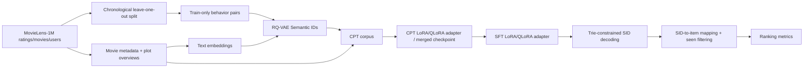

# Pipeline

## CPT corpus

The active Qwen CPT series uses a pre-built curriculum corpus:

- `15` synthetic corpus epochs.
- One Trainer epoch over the generated corpus.
- `50%` behavior windows and `50%` metadata/content examples.
- Behavior windows are built only from the train split.
- Metadata examples cover all catalog items each synthetic epoch.
- Description examples are sharded across synthetic epochs.

## SFT task

SFT is next watched item prediction. The model sees a fixed user history window
and generates the target item SID. Loss is applied to target tokens only.

The current main Qwen3 run uses a window of `16` visible history items and
filters recommendations against the user's full prior history during
validation/test evaluation.

## Decoding

Decoding is constrained by a trie over valid item SID token sequences. Generated SID sequences are mapped back to original item indices before metric computation.
